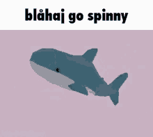

### ✨ Hi there! ✨

I make stuff you probably don't care about but I'd appreciate if you did

## 🌟 Stuff I'm Proud Of

- [**🌿 podzol**](https://github.com/morr0ne/podzol)\
  A very cool package manager for making Minecraft modpacks\
  without going _completely_ insane.

- [**🎶 verdi**](https://github.com/verdiwm/verdi)\
  The Verdi project: A futile (but determined!) attempt at writing a good\
  Wayland ecosystem from scratch. Because sometimes you just have to\
  reinvent the wheel... in Rust.

- [**🎬 comfycast**](https://github.com/comfycast/comfycast)\
  An easy to use but powerful hosted media center for all your legally\
  owned files. _\*wink wink\*_

- [**🍞 bread**](https://github.com/bread-bootloader/bread)\
  An attempt at a UEFI bootloader that doesn't suck.\
  Can't guarantee it won't toast your system

## 🌈 Silly Things

- [**📸 boop**](https://github.com/morr0ne/boop)\
  A lossless image format that's way too good considering how simple it is.

- [**🧸 plushie**](https://github.com/plushie-lang/plushie)\
  A very cutesy programming language you probably shouldn't use.\

- [**🎂 cake**](https://github.com/morr0ne/cake)\
  Portal credits in your browser! _(Valve please don't sue me :3)_

### ⭐️ spinny friend goes brrrr ⭐️

_This blåhaj has spun approximately 127,394 times since you started reading_

---

🏳️‍⚧️ Made with sillyness and monster 🏳️‍⚧️

